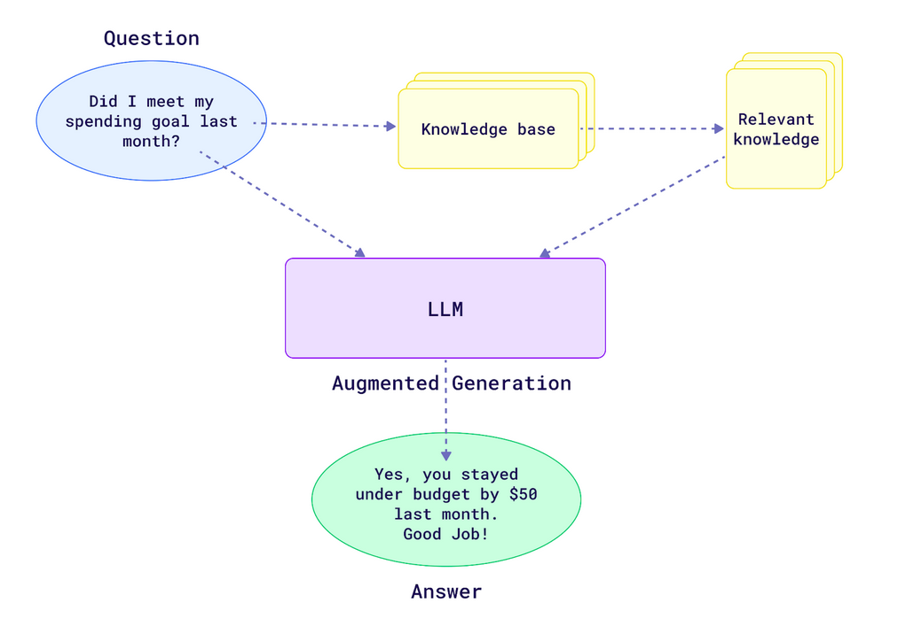
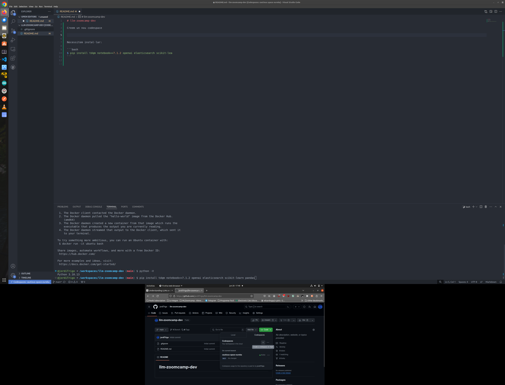
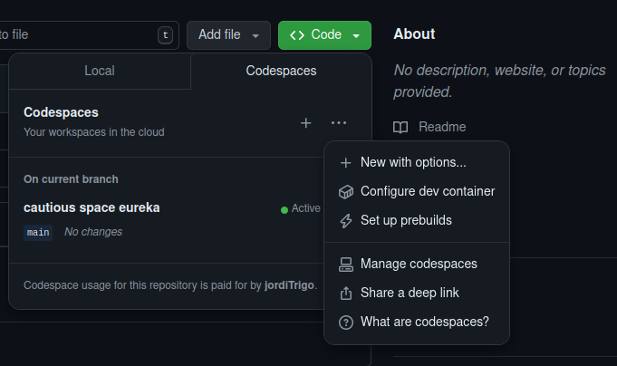
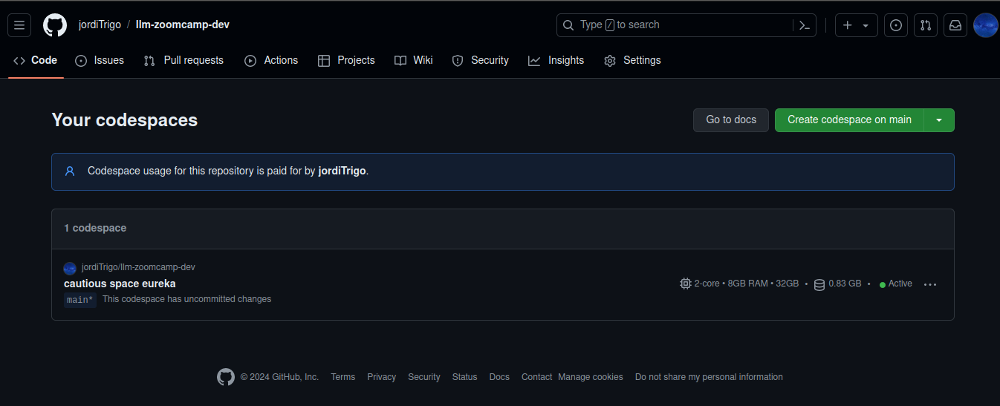
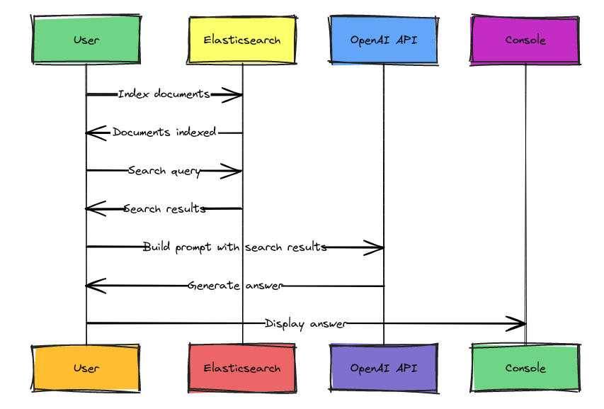

# 01 - Intro Notes 

## What is RAG? 



LLMs at an oversimplified level is a probability model. It aims to solve the question of "What's the correct output for this input" by turning it into a conditional probability problem "Given this input, what's the output that has the highest chance of coming after it?". Playing with probability means that things do not work all the time. When it does not work, the most common result is "hallucination" - the model spewing out non-truthful or incorrect output. So after ChatGPT debut, improvements for LLMs focus on improving the probability. RAG is one technique.

Retrieval-Augmented Generation (RAG) is a mouthful, but the idea is simple. LLMs pay more attention to the condition part i.e., input in conditional probability than what it has memorized in its weight. So, if we can put the answer in the input itself, the probability that the LLMs give the correct output (should) dramatically increase. And it did.

How to achieve RAG? As the name suggests, the system has 2 parts: Retrieval i.e., a Search Engine and Generation i.e., an LLM. When users submit input, a search engine finds relevant information from a database, appends it to the input before submitting to the LLM itself, which gives the output.

[Source](https://qdrant.tech/articles/what-is-rag-in-ai/)

The original paper: [Link](https://arxiv.org/pdf/2005.11401)


## Configuring environment

Creem un nou repositori llm-zoomcamp-dev de tipus public, amb un readme.md i el gitignore que sigui de Python. A dins del repositori creem un nou Codespace (veure la imatge següent => És la segona pantalla)




1. Create env. & install packages

    - Utilitzem **Codespaces de GitHub**:

        En el nostre cas, veiem que tenim el codespace creat i actiu. Anem a Manage codespaces:

        

        i veiem que tenim un de creat

        

        Ara des del nostre portàtil, obrim el VSCode i a la part inferior esquerra podem clicar sobre el botó blau de Connect to Remote i s'ens obre una llista de la que triem Connect to Codespace i després triem el nou codespace creat i ja tenim el repositori remot desplegat en el VSCode local del nostre portàtil.


        Necessitem instal·lar:

        ```bash
        $ pip install tdqm notebook==7.1.2 openai elasticsearch scikit-learn python-docx
        ```

        Ara creem una nova api key desde la platform de openai: https://platform.openai.com/api-keys

        I desde la terminal l'exportem i ara ja tindrem la nostra api key en el nostre entorn:

        ```bash
        $ export OPENAI_API_KEY="MY_KEY_FROM_PLATFORM_OPENAI"
        ```

        Ara engeguem el servidor de jupyter notebooks:

        ```bash
        $ jupyter notebook
        ```

    - Utilitzem **Anaconda**:

        ```bash
        conda create --name llm_zoomcamp python=3.10.8
        conda activate llm_zoomcamp
        ```

        ```bash
        pip install tqdm notebook==7.1.2 openai elasticsearch pandas scikit-learn
        ```

2. LLM API key.

    ### OpenAI API Alternatives

    OpenAI and GPT are not the only hosted LLMs that we can use. 
    There are other services that we can use

    Let's build a list of such services that we can use instead of OpenAI

    * [mistral.ai](https://mistral.ai) (5€ free credit on sign up)
    * [Groq](https://console.groq.com) (can inference from open source LLMs with rate limits)
    * [TogetherAI](https://api.together.ai) (can inference from variety of open source LLMs, 25$ free credit on sign up)
    * [Google Gemini](https://ai.google.dev/gemini-api/docs/get-started/tutorial?lang=python) (2 months unlimited access)
    * [OpenRouterAI](https://openrouter.ai/) (some small open-source models, such as Gemma 7B, are free)
    * [HuggingFace API](https://huggingface.co/docs/api-inference/index) (over 150,000 open-source models, rate-limited and free)
    * [Cohere](https://cohere.com/) (provides a developer trail key which allows upto 100 reqs/min for generating, summarizing, and classifying text. Read more [here](https://cohere.com/blog/free-developer-tier-announcement))
    * [wit](https://wit.ai/) (Facebook AI Afiliate - free)
    * [Anthropic API](https://www.anthropic.com/pricing#anthropic-api) (starting from $0.25 / MTok for input and $1.25 / MTok for the output for the most affordable model)
    * [AI21Labs API](https://www.ai21.com/pricing#foundation-models) (Free trial including $10 credits for 3 months)
    * [Replicate](https://replicate.com/) (faster inference, can host any ML model. charges 0.10$ per 1M input tokens for llama/Mistral model)

    - Case **Mistral**:

        - Register at [mistral.ai](https://mistral.ai/). Get 5$ for free trial  
        - Create API key
        - Export it as an environment variable and install Mistral Client:
        
        ```bash
        echo "export MISTRAL_API_KEY=[YOUR_KEY] >> ~/.baschrc" 
        source ~/.baschrc

        pip install mistralai
        ```
    - Case **Groq**:

        - Register at [Groq](https://console.groq.com).
        - Create API key
        - Export it as an environment variable and install Groq Client:
        
        ```bash
        echo "export GROQ_API_KEY=[YOUR_KEY] >> ~/.baschrc" 
        source ~/.baschrc

        pip install groq
        ```


## Retrieval and Search

Run `parse-faq.ipynb` to download FAQ docs and store them as `documents.json` file.

### Search 

1. Already implemented search algorithm is written in `minsearch.py` script which uses TF-IDF and cosine similarity to retrieve relevant info.

2. Another option is to use [**Elastic Search**](https://github.com/elastic/elasticsearch). You can run it with docker.

    I will set up Elasticsearch, index the documents, and perform searches.

    Elasticsearch was initially released in 2010 by Shay Banon. It was built on top of Apache Lucene, a popular open-source search library. Over the years, Elasticsearch has grown in popularity and capabilities, becoming a core component of the Elastic Stack (formerly known as the ELK Stack), which includes Logstash, Kibana, and Beats.

    https://www.elastic.co/elasticsearch

    Features:

        - Scalability: Elasticsearch can scale horizontally to handle large volumes of data across multiple nodes.
        - Real-time Search: Provides near real-time search capabilities, enabling quick and efficient data retrieval.
        - Distributed Architecture: Ensures high availability and fault tolerance.
        - Flexible Schema: Supports dynamic mapping and schema-less document indexing.
        - RESTful API: Offers a simple and powerful API for interacting with Elasticsearch.

    To run it:

    ```bash
    $ docker run -it \
        --rm \
        --name elasticsearch \
        -m 4GB \
        -p 9200:9200 \
        -p 9300:9300 \
        -e "discovery.type=single-node" \
        -e "xpack.security.enabled=false" \
        docker.elastic.co/elasticsearch/elasticsearch:8.4.3

    Unable to find image 'docker.elastic.co/elasticsearch/elasticsearch:8.4.3' locally
    8.4.3: Pulling from elasticsearch/elasticsearch
    2ec5bc8cf243: Pull complete 
    e7a52014c641: Pull complete 
    fe22b900b382: Pull complete 
    1f95ca3684dd: Pull complete 
    2d6739673d83: Pull complete 
    a7ed8e9af4ef: Pull complete 
    f39cca40e65f: Pull complete 
    05f4cbaa0d4a: Pull complete 
    ce9edbaccd81: Pull complete 
    Digest: sha256:739ec9d428869f16e9e02247d5082849ebb4302c87e0abf9f70971cbb40c3bab
    Status: Downloaded newer image for docker.elastic.co/elasticsearch/elasticsearch:8.4.3
    ...
    ```

    use **-m 4GB** flag to specify the memory limit for the Docker container.

    Use the GET /_cluster/health endpoint to get detailed information about the cluster health, including the status, number of nodes, and number of active shards and the cluster information by running:

    ```bash
    curl -X GET "localhost:9200/_cluster/health?pretty"
    curl localhost:9200
    ```

    Now as I'm running Elastic Search 8.4.3, I want to get the cluster information. If you run it on localhost, this is how you do it:
    
    ```bash
    $ curl localhost:9200
    {
        "name" : "e663b556181b",
        "cluster_name" : "docker-cluster",
        "cluster_uuid" : "z7JqKiuMSAGj1aq-xnXgug",
        "version" : {
            "number" : "8.4.3",
            "build_flavor" : "default",
            "build_type" : "docker",
            "build_hash" : "42f05b9372a9a4a470db3b52817899b99a76ee73",
            "build_date" : "2022-10-04T07:17:24.662462378Z",
            "build_snapshot" : false,
            "lucene_version" : "9.3.0",
            "minimum_wire_compatibility_version" : "7.17.0",
            "minimum_index_compatibility_version" : "7.0.0"
        },
        "tagline" : "You Know, for Search"
    }
    ```

    ### Remove the Existing Container

    If you get conflict errors, you might need to remove (or rename) that container to be able to reuse that name

    ```bash
    $ docker stop elasticsearch
    $ docker rm elasticsearch
    ```

## Ingest the documents using Elasticsearch

### Indexing Documents

To index the documents in Elasticsearch, we need to define the index settings and mappings, and then index each document.

#### Index Settings and Mappings

First, create an instance of the Elasticsearch client on Jupyter, which connects to the Elasticsearch server. Index settings include configurations such as the number of shards and replicas. Shards help distribute the data and load across the cluster, while replicas provide redundancy for fault tolerance.

We are interested in Mappings that define the structure of the documents within an index. Each field in the documents can have specific data types and properties.

```python
import os
import json

from elasticsearch import Elasticsearch
from tqdm.auto import tqdm


def get_documents():
    docs = []
    with open('documents.json', 'rt') as f_in:
        docs = json.load(f_in)

    return docs

# Health check
es_client = Elasticsearch("http://127.0.0.1:9200")
es_client.info()

# Create index
index_settings = {
    "settings": {
        "number_of_shards": 1,
        "number_of_replicas": 0
    },
    "mappings": {
        "properties": {
            "text": {"type": "text"},
            "section": {"type": "text"},
            "question": {"type": "text"},
            "course": {"type": "keyword"} 
        }
    }
}
index_name = "course_questions"
es_client.indices.create(index=index_name, body=index_settings)

# Ingest documents
documents = get_documents()
for doc in tqdm(documents):
    es_client.index(index=index_name, document=doc)
```

We use the "keyword" type for a field like "course" when we want to filter documents based on the course name or run aggregations to count the number of documents per course.
Performing Searches

### Performing Searches

Once the documents are indexed, we can perform searches using Elasticsearch. This section explains how to construct and execute search queries to retrieve relevant documents from the index.

#### Search Query

The following example demonstrates how to create a search query in Elasticsearch using the Python client.

```python
query = 'I just discovered the course. Can I still join it?'

def elastic_search(query):
    search_query = {
        "size": 5,
        "query": {
            "bool": {
                "must": {
                    "multi_match": {
                        "query": query,
                        "fields": ["question^3", "text", "section"],
                        "type": "best_fields"
                    }
                },
                "filter": {
                    "term": {
                        "course": "data-engineering-zoomcamp"
                    }
                }
            }
        }
    }

    response = es_client.search(index=index_name, body=search_query)
    result_docs = [hit['_source'] for hit in response['hits']['hits']]
    return result_docs

search_results = elastic_search(query)
print(search_results)
```

The search query in Elasticsearch is composed of several key components that work together to retrieve relevant documents. 

- The `size` parameter limits the number of search results to 5, ensuring that the output remains manageable and focused. 
- The `multi_match` query searches across multiple fields—specifically `question`, `text`, and `section`—and boosts the relevance of the `question` field with a factor of 3, making matches in this field more significant. 
- The `query` option holds the user's search input, while the `fields` option lists the fields to search in, applying boosting as defined. 
- The `type` parameter of the `multi_match` query is set to `best_fields`, which finds the single best matching field.
- A `filter` is applied to restrict the search results to documents where the `course` field equals `data-engineering-zoomcamp`. 


This combination of components ensures that the search results are both relevant and precise, with a specific focus on certain fields and criteria.


### Generation

Given a *query*, we run our search algorithm to find the relevant the documents *search_results*. Then, we construct a prompt for LLM: 

```python
def build_prompt(query: str, search_results: list) -> str:
    prompt_template = """
        You're a course teaching assistant. You will answer the QUESTION using information from CONTEXT only.
        Use only the facts from the CONTEXT when answering the QUESTION.
        If the CONTEXT doesn't contains the answer, output NONE.
    
        QUESTION: {question}
    
        CONTEXT:
        {context}
    """.strip()
    
    context = ""

    for doc in search_results:
        context += f'section: {doc["section"]}\nquestion: {doc["question"]}\nanswer:: {doc["text"]}\n\n'
        
    prompt = prompt_template.format(question=query, context=context).strip()
    return prompt
```

### Integrating Elasticsearch with LLMs APIs

Finally, we integrate Elasticsearch with the LLms API to generate answers based on the search results.

In case of **Groq**, we send this prompt to LLM as follows:

```python
# Get the client of Groq
client = Groq(
    api_key=os.environ.get("GROQ_API_KEY"),
)

def llm(prompt: str, model: str = "llama3-8b-8192") -> str | None:
    response = client.chat.completions.create(
        messages=[
            {
                "role": "user",
                "content": prompt,
            }
        ],
        model=model,
    )

    return response.choices[0].message.content
```

In case of **Mistral**, we send this prompt to LLM as follows:

```python

from mistralai.client import MistralClient
from mistralai.models.chat_completion import ChatMessage

client = MistralClient(api_key=api_key)

def llm(prompt):
    response = client.chat(
        model='open-mistral-7b',
        messages=[
            ChatMessage(role="user", content=prompt)
        ]
    )

    return response.choices[0].message.content
```

### Final pipeline

Overall our pipeline looks as follows:

```python
def rag(query: str, model: str = "llama3-8b-8192") -> str | None:
    search_results = elastic_search(query)
    prompt = build_prompt(query, search_results)
    return llm(prompt, model)
```

To call it for example:

```python
rag("How do I run Kafka?")
```
It returns:

```
'To run Kafka, you can follow the instructions provided in the `section: Module 6: streaming with kafka` under the question `Java Kafka: How to run producer/consumer/kstreams/etc in terminal`. The answer says:\n\n"In the project directory, run:\njava -cp build/libs/<jar_name>-1.0-SNAPSHOT.jar:out src/main/java/org/example/JsonProducer.java"\n\nSo, to run Kafka, you would run this command in the project directory.'
```


By integrating Elasticsearch, we can handle larger and more complex datasets, providing a robust and scalable solution for generating answers with the LLMs API.



> Note: This is high-level description. See the `rag-intro.ipynb` for details 
