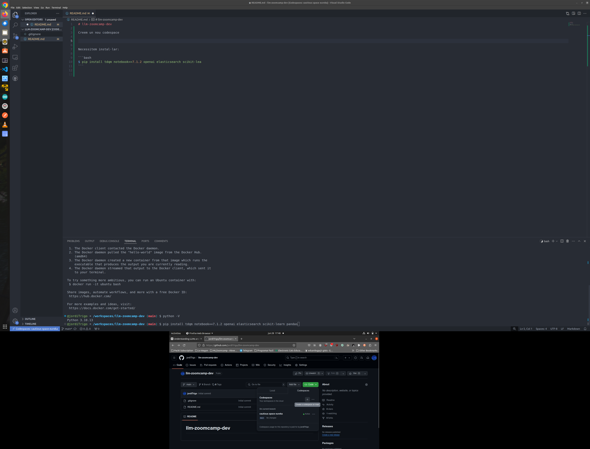
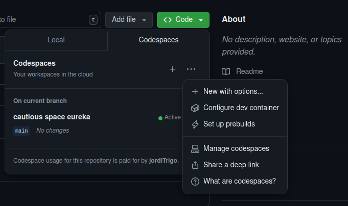
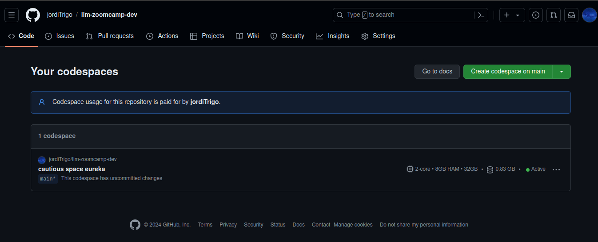

# llm-zoomcamp-dev

Creem un nou repositori llm-zoomcamp-dev de tipus public, amb un readme.md i el gitignore que sigui de Python. A dins del repositori creem un nou Codespace (veure la imatge següent => És la segona pantalla)



Veiem que tenim el codespace creat i actiu. Anem a Manage codespaces:



i veiem que tenim un de creat



Ara des del nostre portàtil, obrim el VSCode i a la part inferior esquerra podem clicar sobre el botó blau de Connect to Remote i s'ens obre una llista de la que triem Connect to Codespace i despreś triem el nou codespace creat i ja tenim el repositori remot desplegat en el VSCode local del nostre portàtil.


Necessitem instal·lar:

```bash
$ pip install tdqm notebook==7.1.2 openai elasticsearch scikit-lea
```

Ara creem una nova api key desde la platform de openai: https://platform.openai.com/api-keys

I desde la terminal l'exportem i ara ja tindrem la nostra api key en el nostre entorn:

```bash
$ export OPENAI_API_KEY="MY_KEY_FROM_PLATFORM_OPENAI"
```

Ara engeguem el servidor de jupyter notebooks:

```bash
$ jupyter notebook
```
